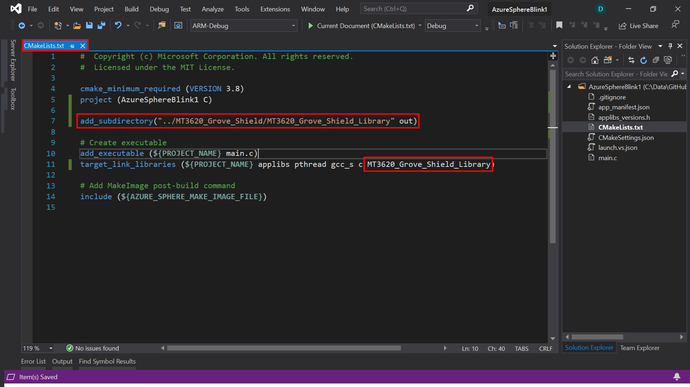

# Getting started with the Azure Sphere MT3620 Development Kit

| Azure Sphere   |  Image  |
| ---- | ---- |
| Azure Sphere MT3620 Development Kit |  |
| Azure Sphere MT3620 Development Kit Shield |  |


## Create new Visual Studio Azure Sphere Project


### Select Azure Sphere Project Template


### Configure new Azure Sphere Project


### Open CMakeLists.txt


### Add Reference to MT3620_Grove_Shield_Library




## Application Manifest Capabilities by Sensor

## Define Application Capabilities Model

1. Open **app_manifest.json**
2. Add GPIO Pins 57, and 58
3. Add Uart ISU0

```json
{
  "SchemaVersion": 1,
  "Name": "AzureSphereBlink1",
  "ComponentId": "a3ca0929-5f46-42b0-91ba-d5de1222da86",
  "EntryPoint": "/bin/app",
  "CmdArgs": [],
  "Capabilities": {
    "Gpio": [ 9, 57, 58 ],
    "Uart": [ "ISU0" ],
    "AllowedApplicationConnections": []
  },
  "ApplicationType": "Default"
}
```

## Read Grove Light Sensor

1. Open main.c
2. add Grove Sensor headers after the _#include <applibs/gpio.h>_ header declaration.
    ```c
    #include "../MT3620_Grove_Shield/MT3620_Grove_Shield_Library/Grove.h"
    #include "../MT3620_Grove_Shield/MT3620_Grove_Shield_Library/Sensors/GroveLightSensor.h"
    #include "../MT3620_Grove_Shield/MT3620_Grove_Shield_Library/Sensors/GroveAD7992.h"
    ```

### Initialize the Grove Light Sensor

1. Open main.c
2. in the main method, just before _const struct timespec sleepTime = {1, 0};_

    ```c
    // Initialize Grove Shield
    int i2cFd;
    GroveShield_Initialize(&i2cFd, 115200);

    // Initialize Light Sensor
    void* light = GroveLightSensor_Init(i2cFd, 0);
    ```

### Read Grove Light Sensor Telemetry

1. In main.c inside the _while_ loop add

    ```c
    float value = GroveLightSensor_Read(light);
    value = GroveAD7992_ConvertToMillisVolt(value);
    Log_Debug("Light value %dmV\n", (uint16_t)value);
    ```

### Putting it all together

```c
#include <stdbool.h>
#include <errno.h>
#include <string.h>
#include <time.h>

#include <applibs/log.h>
#include <applibs/gpio.h>

#include "../MT3620_Grove_Shield/MT3620_Grove_Shield_Library/Grove.h"
#include "../MT3620_Grove_Shield/MT3620_Grove_Shield_Library/Sensors/GroveLightSensor.h"
#include "../MT3620_Grove_Shield/MT3620_Grove_Shield_Library/Sensors/GroveAD7992.h"

int main(void)
{
    Log_Debug(
        "\nVisit https://github.com/Azure/azure-sphere-samples for extensible samples to use as a "
        "starting point for full applications.\n");

    // Change this GPIO number and the number in app_manifest.json if required by your hardware.
    int fd = GPIO_OpenAsOutput(9, GPIO_OutputMode_PushPull, GPIO_Value_High);
    if (fd < 0) {
        Log_Debug(
            "Error opening GPIO: %s (%d). Check that app_manifest.json includes the GPIO used.\n",
            strerror(errno), errno);
        return -1;
    }

    // Initialize Grove Shield
    int i2cFd;
    GroveShield_Initialize(&i2cFd, 115200);
    void* light = GroveLightSensor_Init(i2cFd, 0);

    const struct timespec sleepTime = {1, 0};
    while (true) {

        float value = GroveLightSensor_Read(light);
        value = GroveAD7992_ConvertToMillisVolt(value);
        Log_Debug("Light value %dmV\n", (uint16_t)value);

        GPIO_SetValue(fd, GPIO_Value_Low);
        nanosleep(&sleepTime, NULL);
        GPIO_SetValue(fd, GPIO_Value_High);
        nanosleep(&sleepTime, NULL);
    }
}

```

## Capabilities by Sensor Type Quick Reference

| Sensors  | Socket | Capabilities |
| :------------- | :------------- | :----------- |
| Grove Light Sensor  | Analog | "Gpio": [ 57, 58 ], "Uart": [ "ISU0"] |
| Grove Rotary Sensor | Analog | "Gpio": [ 57, 58 ], "Uart": [ "ISU0"] |
| Grove 4 Digit Display | GPIO0 or GPIO4 | "Gpio": [ 0, 1 ] or "Gpio": [ 4, 5 ] |
| Grove LED Button | GPIO0 or GPIO4 |  "Gpio": [ 0, 1 ] or "Gpio": [ 4, 5 ] |
| Grove Oled Display 96x96 | I2C | "Uart": [ "ISU0"]  |
| Grove Temperature Humidity SHT31 | I2C | "Uart": [ "ISU0"] |
| Grove UART3 | UART3 | "Uart": [ "ISU3"] |
| LED 1 | Red <br/> Green <br/> Blue | "Gpio": [ 8 ] <br/> "Gpio": [ 9 ] <br/> "Gpio": [ 10 ] |
| LED 2 | Red <br/> Green <br/> Blue | "Gpio": [ 15 ] <br/> "Gpio": [ 16 ] <br/> "Gpio": [ 17 ] |
| LED 3 | Red <br/> Green <br/> Blue | "Gpio": [ 18 ] <br/> "Gpio": [ 19 ] <br/> "Gpio": [ 20 ] |
| LED 4 | Red <br/> Green <br/> Blue | "Gpio": [ 21 ] <br/> "Gpio": [ 22 ] <br/> "Gpio": [ 23 ] |

For more pin definitions see the __mt3620_rdb.h__ in the MT3620_Grove_Shield/MT3620_Grove_Shield_Library folder.
